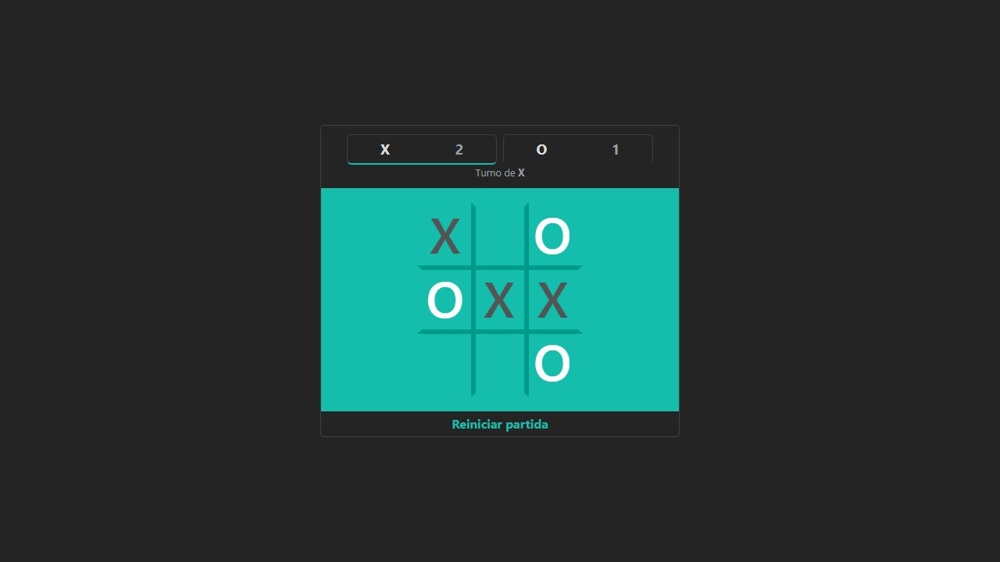

# TIC TAC TOE ⚔️

<div align='center'>
  
  
  
  
  
  
</div>

<br />
Un clon del juego tic tac toe de google sin la funcionalidad de jugar contra la máquina.

<br />
⭕ ❕ ❌ &nbsp;❕ ❌<br />
➖➕➖➕➖<br />
⭕ ❕ ⁣❌ &nbsp;❕ ⭕<br />
➖➕➖➕➖<br />
❌ ❕ ⭕ &nbsp;❕ ❌

<br />


## Instalación 📖

Instala todas las dependencias del proyecto con:

`npm install ó npm i`

## Ejecutar el proyecto 🔥

Para iniciar el proyecto ejecuta el comando:

`npm run dev`

## Tests con Jest 🧪

Tests con jest y testing-library/react

```bash
npm test # Ejecutar todos los tests
npm run coverage # Revisar el coverage de los tests
```

## Test e2e con Playwright 🧪🎭
Todos los tests con playwright están en la carpeta tests

```bash
npx playwright test tests/ #Ejecutar todos los tests
npx playwright test tests/nombreDelArchivo.spec.js # Ejecutar un test
npx playwright test tests/carpeta/nombreDelArchivo.spec.js # Indicar la carpeta si hay una
```

